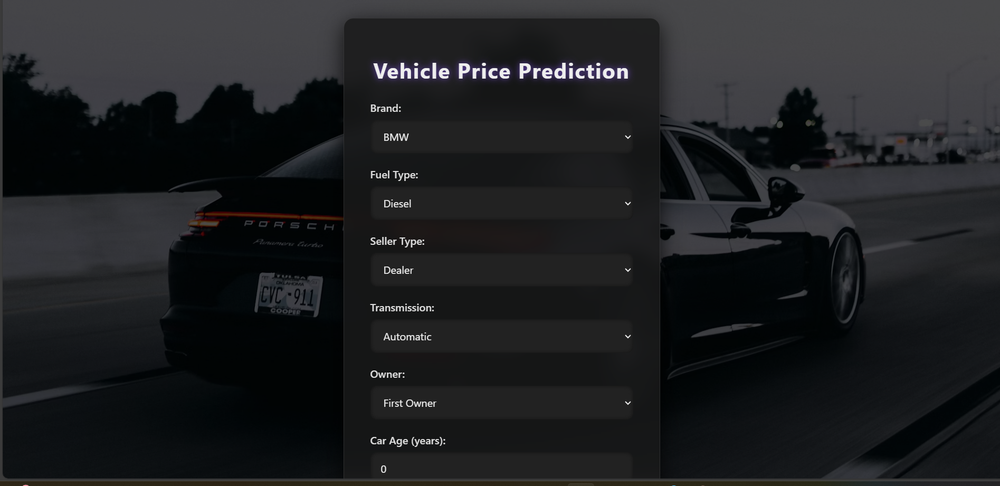
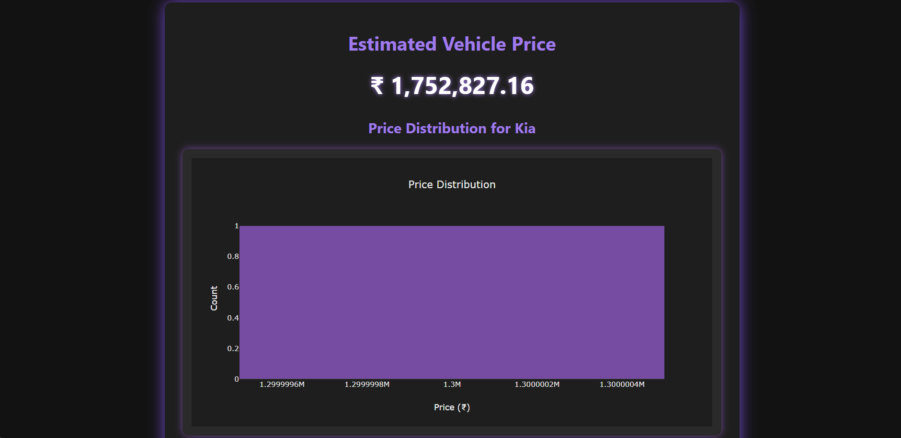

# Vehicle Price Prediction System

An end-to-end machine learning web application that predicts vehicle prices based on important vehicle features such as brand, model, fuel type, transmission, ownership history, and manufacturing year. The project combines data preprocessing, feature engineering, model training, evaluation, and deployment through an interactive web interface.

## Overview

Used vehicle pricing is an important problem for both buyers and sellers, as the price of a vehicle depends on multiple factors such as age, mileage, fuel type, transmission, and brand value. This project was built to estimate vehicle prices accurately using machine learning and provide users with a simple interface for real-time predictions.

## Key Features

- Predicts vehicle prices from user input features.
- Includes data cleaning and preprocessing for real-world used car data.
- Uses feature engineering for better model performance.
- Evaluates model performance using regression metrics.
- Interactive web application for real-time predictions.
- End-to-end workflow from preprocessing to deployment.

## Dataset

- Used vehicle dataset containing attributes such as company, model, year, fuel type, kilometers driven, and transmission.

## Model & Performance

| Model | Task | Evaluation Metrics |
|-------|------|--------------------|
| Random Forest Regressor | Vehicle Price Prediction | MAE, RMSE, R² Score |

Additional performance details and experiments are available in the training notebooks and project files.

## What I Built

- Data cleaning and preprocessing for structured vehicle data.
- Feature engineering and categorical variable handling.
- Model training using Random Forest Regressor.
- Model evaluation using regression metrics such as MAE, RMSE, and R² score.
- Model serialization using joblib for deployment.
- Web application for real-time vehicle price predictions.
- Deployment-ready project with organized code and dependency files.

## Demo

- **Live Demo:** [Try the app](https://vehicle-price-predictor-4075.onrender.com)


## Screenshots

### Main Dashboard


### Prediction Result


## Project Structure

```text
vehicle-price-prediction/
├── app.py
├── notebooks/
├── models/
├── src/
├── assets/
├── requirements.txt
└── README.md
```

## Example Usage

- Enter vehicle details such as brand, year, fuel type, kilometers driven, and transmission.
- Click **Predict Price**.
- The system returns the estimated vehicle price instantly, and show graph for Price Distribution.

## Tech Stack

- Python
- Pandas
- NumPy
- Scikit-learn
- Random Forest Regressor
- Flask 
- Joblib
